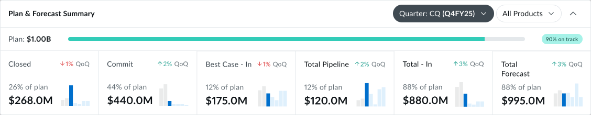

# Plan & Forecast Summary — Reference

A companion doc, in the same spirit as the table and panel reference
docs in this folder. Written for designers, PMs, and data architects.

If something here contradicts the Figma file, the Figma is the source
of truth for *visual shape*; this doc is the source of truth for
*what the component is and why each part exists*.

Companion to:
- `accounts-table-reference.md`, `opportunities-table-reference.md` —
  the row-level surfaces that sit *below* this summary.
- `account-panel-reference.md` — the right-hand panel for a single
  account.
- `sales-play-reference.md` — the play/family model that feeds the
  pipeline numbers this summary aggregates.

---

## 1. Purpose

The Plan & Forecast Summary is the **top-of-page banner** that tells
the AE (or sales manager) *"are we going to make the number this
quarter?"* — in one line if it's collapsed, in six numbers if it's
expanded.

It is the single piece of the workbench that answers the question at
the **plan level**, not the row level. The tables below it answer
*"which deals?"*; this summary answers *"are the deals enough?"*

It has two states:

- **Collapsed** — one-line plan attainment readout.
- **Expanded** — the six forecast categories that make up that
  attainment, each with its own value, plan share, QoQ trend, and a
  mini history chart.

The same controls (quarter selector, product filter, expand toggle)
sit on the right side in both states.

---

## 2. Anatomy — Collapsed State

A single horizontal strip. A header and one row of content inside a
card.

**Header**

- **Plan & Forecast Summary** — the component title, left-aligned.
- **Quarter selector** — a single-select pill labeled *Quarter*.
  Options are `PQ (Q3FY26)`, `CQ (Q4FY26)`, `NQ (Q1FY27)`,
  `NQ+1 (Q2FY27)` — relative label plus absolute fiscal quarter.
  **CQ** is the default. The fiscal-quarter labels are anchored to
  TODAY = 2026-05-11 in PANW's Aug→Jul fiscal calendar (May 2026 sits
  in Q4FY26); they roll forward when the anchoring date does.
- **Product filter** — defaults to *All Products*. Scopes every
  number in the summary to the chosen product or product family.
  Same product taxonomy as the rest of the workbench.
- **Expand toggle** — a ghost `IconButton` with a chevron that
  flips up/down by state. State is per-session, not persisted.

> **Component note:** the Quarter and Product selectors use the
> DS **`Sort`** primitive (single-select, sibling of `Filter`),
> with the directional glyph suppressed. Same trigger chrome
> family as `Filter`, same keyboard behavior, but the underlying
> primitive is `Sort`, not `Filter`. Reusing the primitive across
> the page is still intentional — same look, same keyboard
> behavior, same single-select grammar. Their visual treatment in
> the Figma (dark-filled vs. outline) reflects the selector's
> *state*, not a different component.

**Row 1 — Attainment readout**

- **Plan: $1.00B** — the quarterly plan/target, rendered as a
  `Plan:` label + bold `$1.00B` value, scoped to the selected
  quarter and product filter.
- **Progress bar** — a horizontal bar filled to the share of plan
  that's currently *committed or better*. In the screenshots,
  ~88% green corresponds to *Total - In = $880M* against a $1.00B
  plan, i.e., *"88% on track"*. The bar is the visual anchor for
  the on-track classification tag.
- **On-track tag** — a single tag on the right end of the bar
  reading e.g., *"88% on track"*. Color follows the on-track
  ladder: **0–25% red**, **26–75% yellow**, **76%+ green**. The
  percentage is a rounded reading of the same underlying signal
  the bar visualizes, not a separate metric.

> **Designer takeaway:** the collapsed state is meant to be readable
> in *one glance from across the room*. The number is the plan, the
> bar is the attainment, the tag is the verdict.

---

## 3. Anatomy — Expanded State

**Reference screenshot:** `./assets/plan-summary-expanded.png`
*(captured from the Figma "Open=yes, Orientation=Horizontal" variant,
node `36546-179607`).*

A collapsed-state reference also lives at
`./assets/plan-summary-collapsed.png` *(node `36546-179608`)* for
side-by-side comparison.

Adds a **6-cell horizontal strip** below the attainment readout.
Each cell is one forecast category. Order (left to right) is
deliberate: Closed → Commit → Best Case - In → Total Pipeline →
Total - In → Total Forecast. The first three are the building
blocks, the last three are rollups.

**Inside each cell** (top to bottom):

1. **Category label** — *Closed*, *Commit*, *Best Case - In*,
   *Total Pipeline*, *Total - In*, *Total Forecast*.
2. **QoQ trend** — an arrow + percentage + the literal text *"QoQ"*
   (e.g., *↑2% QoQ* in green, *↓1% QoQ* in red). This is the
   quarter-over-quarter change in this category's contribution.
   Green = up, red = down. The color is a directional signal, not a
   value judgment — *↓Pipeline* and *↑Closed* are both arguably
   good, but the tag just reports direction. QoQ lives in the cell
   header (top-right of the cell), while `% of plan` and the
   dollar value stack in the lower-left.
3. **% of plan** — the category's share of the quarterly plan, e.g.,
   *"26% of plan"*. Small, muted text, sits in the lower-left of
   the cell above the dollar value.
4. **Dollar value** — the category's absolute dollar value for the
   selected quarter, large and bold (e.g., *$268.0M*). This is the
   number the AE reads first when scanning a cell.
5. **Mini trend sparkline** — a 7-bar sparkline spanning **2 past +
   current + 4 future** quarters relative to the selected quarter.
   **Past** bars are neutral gray; the **current** bar is solid
   cobalt (`cobalt-60`); **future** bars are light cobalt
   (`cobalt-30`). No axis labels — this is a sparkline, not a
   chart. Its job is to tell the AE *"where is this category
   trending, past → present → forward?"* at a glance.

The cells are evenly distributed across the strip, separated by
1px vertical dividers that span the full strip height.

---

## 4. The Six Forecast Categories

The six cells fall into two groups: three building-block categories
that make up the in-quarter signal, and three rollups.

**Building-block categories**

- **Closed** — bookings already won in the selected quarter. This is
  money in the bank for the quarter; it does not move once the deal
  is closed-won.
- **Commit** — open pipeline the team has *committed* to landing in
  the quarter. Same forecast-category enum as in the opportunities
  table (`commit`).
- **Best Case - In** — open pipeline classified as *Best Case* and
  expected to land *in* the selected quarter. The *"- In"* suffix
  distinguishes in-quarter best case from out-of-quarter pipeline.

**Rollup categories**

- **Total Pipeline** — the full open pipeline for the selected
  quarter, including anything beyond the commit + best-case slice.
  This is the *broadest* pipeline number the page shows. Useful as
  a denominator for coverage ratios.
- **Total - In** — *Closed + Commit + Best Case - In*. The sum of
  the three building blocks. This is the number the attainment bar
  visualizes against plan. In the screenshot: 268 + 440 + 175 = 883,
  rounded to *$880.0M*.
- **Total Forecast** — *Total - In* plus a forecast judgment slice
  drawn from Total Pipeline. This is what the org actually expects
  to deliver, not just what's already in-quarter. In the screenshot:
  *$995.0M*. The exact derivation of the judgment slice is a finance
  rule, not a UI rule (flag to confirm with the data team).

> **Architect takeaway:** Closed, Commit, Best Case - In, and Total
> Pipeline are *primary* values that come from Salesforce / the
> forecast system. Total - In and Total Forecast are *derived* in
> the workbench. Don't let the UI edit derived values directly; let
> the source values change and recompute.

---

## 5. Controls and Filtering

Both controls in Row 1 scope the **entire** summary, including the
six expanded cells and the attainment bar.

- **Quarter selector** — reframes every number to the chosen
  quarter. The CQ default exists because that's the question 95% of
  AE/manager sessions are answering; switching to a future quarter
  turns the summary into a forward-look. The mini history charts
  re-anchor on the chosen quarter (the emphasized bar is always *the
  chosen quarter*, with two past quarters to its left and four
  future quarters to its right).
- **Product filter** — scopes Plan, all six categories, the
  attainment bar, and the mini history charts to the selected
  product. *All Products* is the default. Selecting a single
  product turns this summary into a single-product P&L view.

There is no separate "team / territory" filter on this component —
that scope is set higher up on the page (e.g., the manager has
already chosen their team) and the summary inherits it.

---

## 6. Behaviors

- **Expand/collapse** — toggled by the chevron on the right. Per
  session, not persisted to the user.
- **No editing.** Every number in this summary is read-only. Edits
  belong on the row surfaces (opportunities table, sales-play
  console) and propagate up through aggregation.
- **No drill-down from inside the summary.** The summary does not
  filter the tables below it; quarter and product selections are
  *its own* scope. If the AE wants to filter the tables, they use
  the table's own controls. This is intentional — the summary's job
  is to present a read, not to act as a master filter for the
  page.
- **Live recompute.** Changing the quarter or product re-renders all
  six cells, the bar, the tag, and the mini history charts in one
  pass. There is no per-cell loading state; either the whole
  component is loading or it isn't.

---

## 7. How an AE or Manager Talks About It

> "We're $880M In against a $1.00B plan — 88% on track for the
> quarter."

Maps to: collapsed state — Plan number, attainment bar, on-track
tag.

> "Closed is down 1% QoQ but Commit is up 2%. The miss in Closed is
> coming from one or two slipped deals; the funnel underneath is
> healthier."

Maps to: expanded state — Closed and Commit cells with their QoQ
trends.

> "Total Forecast is $995M. Plan is $1.00B. We have $120M of Total
> Pipeline behind that. Coverage is thin if anything slips."

Maps to: Total Forecast, Plan, Total Pipeline cells, read together
as a coverage story.

> "Filter to Cortex only. We're at 60% of the Cortex plan with
> three weeks to go."

Maps to: product filter scoping the whole summary.

These four sentences are the acceptance test. If the component
can't answer one of them in a single read, the layout has a gap.

---

## 8. What This Document Deliberately Doesn't Cover

- **The forecast category data model.** Same enum as in
  `opportunities-table-reference.md` — Pipeline / Best Case / Commit
  / Closed. The summary aggregates; it does not redefine.
- **The plan-setting process.** Plan numbers come from the finance
  / planning system. The workbench reads them.
- **The exact derivation of Total Forecast's judgment slice.** A
  finance rule, not a UI rule. Flagged for the data team.

---

## 9. Cross-references

- `opportunities-table-reference.md` — the row surface whose
  forecast-category enum this summary aggregates.
- `accounts-table-reference.md` — the row surface whose pipeline
  numbers this summary rolls up by quarter.
- `account-panel-reference.md` — the right-hand panel that opens
  from rows below; the summary stays fixed above as a context
  anchor.
- `sales-play-reference.md` — the play/family motion that ultimately
  produces the opportunities counted in these categories.
