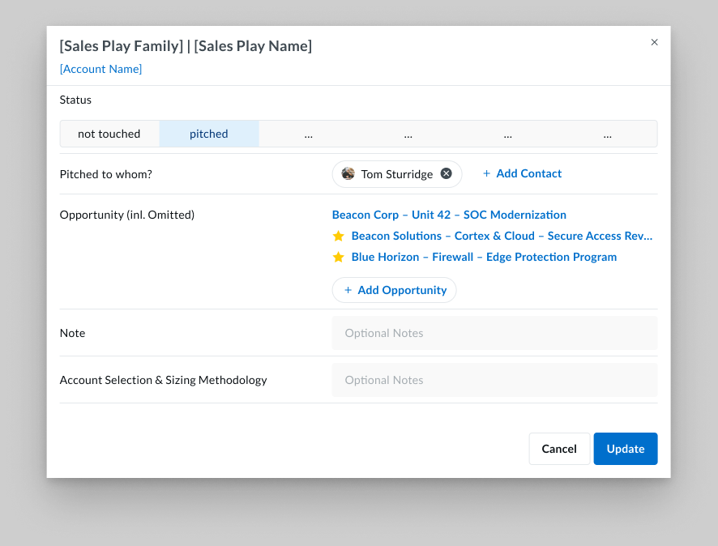

# Sales Play Modal — Reference

A companion doc, in the same spirit as the other reference docs in
this folder. Written for designers, PMs, and data architects.

If something here contradicts the Figma file, the Figma is the source
of truth for *visual shape*; this doc is the source of truth for
*what the component is and why each part exists*.

Companion to:
- `sales-play-reference.md` — the play / family / 7-status model
  this detail dialog reads and writes. The status enum below is
  identical.
- `account-panel-reference.md` — the right-hand panel whose Sales
  Play accordion this dialog opens from.
- `opportunities-table-reference.md` — the row surface the linked
  opportunities here come from.

---

## 1. Purpose

The Sales Play Modal is the **modal dialog** that opens when an AE
clicks into a single (account × sales play) cell — from the matrix
view, from the account panel's Sales Play accordion, or from any
other surface that lists plays.

It answers two questions in one place:

1. *Where does this play stand on this account?* — captured by the
   **Status**, the contact it was pitched to, and free-text notes.
2. *Which opportunities is this play producing?* — captured by the
   list of linked opportunities, with a primary opportunity called
   out and any opportunities optionally excluded from the rollup.

Every play on every account has exactly one of these dialogs. Editing
here is the canonical way to advance a play; the matrix and the
account panel are *read* surfaces that reflect what was last saved
here.

---

## 2. Anatomy

**Reference screenshot:** `./assets/sep-30773-71487-sales-play-modal.png`
*(captured from Figma node `30773:71487` — the canonical simplified
modal).*

Sub-views, captured from the earlier Figma exploration and still
current in shape:

- `./assets/sep-21028-48763.png` — **Link Opportunity** sub-view
  (node `21028:48763`).
- `./assets/sep-21028-48762.png` — **Link Contact** sub-view
  (node `21028:48762`).

An earlier, more orthogonal form of the main dialog lives at
`./assets/sep-21028-48764.png` *(node `21028:48764`)* — kept as a
design-history reference only; the simplified shape above
supersedes it.

The dialog is a single centered modal. Inside, top to bottom:

**Header**

- **Title** — `[Sales Play Family] | [Sales Play Name]`. The family
  and the play name together identify the play (a play name is not
  unique across families). Same naming the AE uses out loud.
- **Account name** — a link below the title, opens the account panel
  or the account record.
- **Close (×)** — top-right. Discards unsaved changes (same as
  Cancel).

**Body** (one labeled row per field, left-aligned labels, right-aligned
controls)

1. **Status** — segmented control with the **7-status enum** from
   `sales-play-reference.md`: *not touched / pitched / deferred /
   declined / pursuing / closed won / closed lost*. Single-select.
   This is the only required field; everything else is optional.
2. **Pitched to whom?** — one or more contact pills, each with a
   remove (×). A `+ Add Contact` action opens the
   [Link Contact sub-view](#3-link-contact-sub-view). Only meaningful
   once Status is past *not touched*; the field is still visible (and
   editable) at *not touched* so an AE can pre-stage the contact.
3. **Opportunity (incl. Omitted)** — a stacked list of linked
   opportunities. Each row is the opportunity name as a link out
   (opens the opportunity in SFDC or the account panel scoped to that
   opp). A **gold star** on a row marks it as the **primary**
   opportunity for the play (exactly one primary at a time;
   tie-breaker if none set is *highest-value pursuing opp*). The
   parenthetical *"incl. Omitted"* means opps flagged as omitted
   still appear here so the AE can see them — they're excluded from
   rollups (e.g., Cumulative Opportunity Size), not from the list.
   A `+ Add Opportunity` action opens the
   [Link Opportunity sub-view](#4-link-opportunity-sub-view).
4. **Note** — optional free-text **textarea**. Placeholder *"Optional
   Notes"*. Multi-line. AE-private context, not for customer
   consumption.
5. **Account Selection & Sizing Methodology** — optional free-text
   **textarea**. Placeholder *"Optional Notes"*. The audit trail for
   *why this play applies to this account and how the dollar value
   was sized*. Captured here because the qualification oracle that
   surfaces plays is opaque — this is the AE's chance to write down
   their own reasoning for posterity.

**Footer**

- **Update** — primary button. Persists all field edits in one
  transaction.
- **Cancel** — secondary button. Discards unsaved changes; same as
  the header ×.

Footer is right-aligned at the bottom of the modal.

> **Designer takeaway:** the dialog deliberately has *only one
> required field* (Status). Everything else is optional so an AE can
> bump the status forward in two clicks (open → pitched → Update)
> without being blocked. The richer fields exist for plays that
> matter.

---

## 3. Link Contact Sub-view

**Reference screenshot:** `./assets/sep-21028-48762.png`
*(node `21028:48762`)*

Opened by `+ Add Contact` from the main dialog. Replaces the modal
body; the same modal frame and title are retained for context.

- **Back to Sales Play Modals** — left-aligned breadcrumb with a
  back arrow. Returns to the main dialog *without losing unsaved
  changes*.
- **Search contacts** — search input, scoped to the account's
  contacts.
- **New Contact** — secondary button, opens contact-creation flow
  (out of scope for this reference).
- **Currently linked** — selected contacts appear as pills above the
  list, each with a remove (×). This is the same set that will show
  in *Pitched to whom?* when the AE returns.
- **Contacts table** — columns: checkbox, **Name**, **Title**,
  **Phone** (link, click-to-call), **Email** (link + copy icon).
  Checking a row links that contact to the play; unchecking removes
  it.
- **Pagination** — page numbers + items-per-page selector at the
  bottom right.

Linking is *write-on-toggle* — the underlying play–contact relation
updates as the AE checks/unchecks, with the main dialog's pending
state staying in sync. The AE still has to click **Update** on the
main dialog to commit.

---

## 4. Link Opportunity Sub-view

**Reference screenshot:** `./assets/sep-21028-48763.png`
*(node `21028:48763`)*

Opened by `+ Add Opportunity` from the main dialog. Same modal-frame
pattern as Link Contact.

- **Back to Sales Play Modals** — breadcrumb back to the main
  dialog.
- **Search opportunities** — search input, scoped to the account's
  open opportunities.
- **New Opportunity** — secondary button, opens opportunity-creation
  flow (out of scope here).
- **Opportunities table** — columns: checkbox, **gold star** (sets
  primary; exactly one row can hold the star), **Opportunity Name**
  (link), **Stage**, **Amount**, **Close Date**. Checking a row links
  the opportunity to the play. Setting the star reassigns the
  primary.
- **Pagination** — page numbers + items-per-page selector at the
  bottom right.

The omit flag (the *"incl. Omitted"* qualifier on the main dialog)
is **not** set from this sub-view — it lives on each opportunity
record itself (presumably from the opportunity panel or table).
Linking and omitting are different verbs: linking attaches an opp to
a play; omitting tells the rollup to ignore it. An opp can be linked
and omitted at the same time.

---

## 5. Behaviors

- **Status is the only required field.** Update is enabled the
  moment Status differs from its loaded value (or any other field
  has been touched).
- **Unsaved changes persist across sub-views.** Navigating into
  Link Contact / Link Opportunity and back does not discard pending
  edits.
- **Cancel and × discard.** Both return the play to its last saved
  state. No confirm dialog on discard — call this out to the data
  team if they want one.
- **Primary opportunity is exclusive.** Setting the star on one row
  in the Link Opportunity sub-view clears the star on the previous
  primary.
- **Status-driven side effects** (governed by `sales-play-reference.md`):
  moving Status to *pursuing* expects at least one linked
  opportunity; *closed won / closed lost* are terminal and inherit
  from the primary opportunity's stage when known.
- **No bulk edit.** The dialog is single-(account × play) only. Bulk
  status changes belong to the matrix view.

---

## 6. How an AE Talks About It

> "Open the **Splunk Takeout** on **Exxon**. Move it to **pitched**,
> note who I pitched to, and link the opportunity that came out of
> the conversation."

Maps to: open dialog → set Status → add contact → Add Opportunity
sub-view → Update.

> "Two of the three linked opps on this play are real; the third is
> a duplicate I want to keep visible but **omit from the rollup**."

Maps to: the *incl. Omitted* qualifier on the Opportunity list — the
duplicate stays in view but doesn't count toward Cumulative
Opportunity Size.

> "We're **pursuing** this, but the primary opp is the SOC
> Modernization one — not the bigger Edge Protection deal."

Maps to: gold-star reassignment in the Link Opportunity sub-view.

> "Why did we even qualify Lucid for this play? Let me read the
> **Account Selection & Sizing Methodology** the rep wrote down."

Maps to: the methodology textarea — the manual audit trail for the
opaque qualification oracle.

These four sentences are the acceptance test. If the dialog can't
answer one of them in a single open–edit–save cycle, the layout has
a gap.

---

## 7. What This Document Deliberately Doesn't Cover

- **The 7-status enum semantics.** Owned by
  `sales-play-reference.md`.
- **Qualification conditions** that decided this play applies to this
  account. Out of scope — the dialog is a read-and-edit surface, not
  a qualification debugger.
- **Cumulative Opportunity Size / Forecast Category / Close Date as
  rollups.** Earlier Figma drafts showed these on the dialog
  directly; the simplified version derives them from linked opps
  outside the dialog. Reconciliation with the matrix and account
  panel rollup logic is pending.
- **New Contact / New Opportunity creation flows.** Each is its own
  surface; this dialog only links to them.
- **Bulk operations and matrix-level interactions.** Belong to the
  matrix view spec.

---

## 8. Cross-references

- `sales-play-reference.md` — the play / family / 7-status enum this
  dialog reads and writes.
- `account-panel-reference.md` — the panel whose Sales Play
  accordion opens this dialog.
- `opportunities-table-reference.md` — the row surface for linked
  opportunities.
- `account-opportunity-domain-model.md` — what an opportunity is once
  it's linked to a play.
